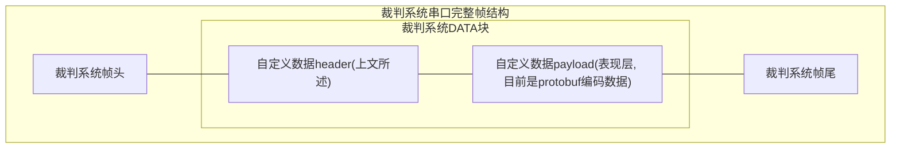
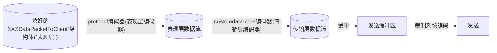
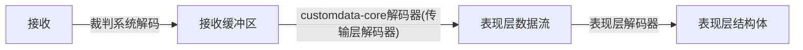

# MasterPilot-CustomData 自定义数据协议

本仓库基于`Protobuf`开发, 用于约定自定义客户端通信协议中的自定义数据.

通信协议中有几处自定义数据:

| 消息名 | 发送方 | 频率 | 大小 |
| --- | --- | --- | --- |
| `CustomByteBlock` | 机器人 | 50Hz | 固定300Byte |
| `CustomControl` | 自定义客户端 | 75Hz | 固定30Byte |

## 数据格式(对应裁判系统通信协议中的`data`块)

`[package_serial]` `[slice_serial]` `[sender_id]` `[eop]` `[slice_payload_length]` `[payload ...]`

**全都是小端序, LSB**

- `package_serial`: **8bit** 数据, 表示此大包的递增序号.
- `slice_serial`: **8bit** 数据, 表示此分片的递增序号.
- `sender_id`: **3bit** 数据, 用于标识发送方, 防止链路冲突.
- `eop`: **1bit** 数据, 1表示当前slice是包最后一片.
- `slice_payload_length`: **12bit** 数据, 表示本次切片的载荷大小. 如果不满则表示发送完成.
- `payload`: 使用`ProtoBuf`编码出来`uint8[]`数据的一部分

这部分可以使用本仓库中`src`里的代码自动完成.

## 完整通信链路数据帧

补充自通信协议手册 - 表1-2



其中:
- `DATA块`: 不使用通信手册中给的结构体, 使用上文讲的`数据格式`.

## 通信流程

### 发送




### 接收



## 使用教学

以无人机为例.

### C


#### 代码拉取

- 第一次使用: git clone [仓库url] -b dist/embedded-src --depth=1
- 后续更新: git pull

#### Keil配置

1. 添加.c源码: 将`src`目录的.c文件添加到`Keil`的编译目标
2. 添加.h路径: 将`include`目录添加到`Keil`的头文件搜索路径, 注意只需要`include`目录, 不需要添加内部的目录, 保持结构.
3. 添加编译宏: 将宏`PB_C99_STATIC_ASSERT`添加到`Keil`的编译宏.

#### 发送(编码)
```c
#include <masterpilot/customdata-embedded-encode.h> //这个是自定义数据编码库
#include <masterpilot/proto/drone.h> //这个是与自定义客户端的表现层协议库. 按你的兵种引用.
#include <stdbool.h>

#define REFREE_CUSTOM_BYTE_BLOCK_LENGTH 300 //自定义数据块长度, 恒定为300

// 假设这是自定义数据发送的结构体
struct
{
	refree_header_t refree_header; //裁判系统帧头, 按你的设计. 长度填300
	uint8_t block[REFREE_CUSTOM_BYTE_BLOCK_LENGTH]; //即将被编码的数据块
	uint16_t crc16_tail;
} refree_customdata_block;

// 这是你的crc计算纯函数. 不建议用官方给的append.
uint16_t calc_crc16(const uint16_t old_crc, const uint8_t* block, const uint16_t size);

// 你的裁判系统图传链路发送.
void refree_vt_send(const uint8_t* block, const uint16_t size);

// crc16计算的中间状态
typedef struct
{
	uint16_t current_crc16;
	uint16_t cursor; // 当前填充位置
} crc16_user_t;

// 顶层封装函数, 操作上面说的 refree_customdata_block.
// 如果你喜欢直接流式发送, 不喜欢填结构体, 可以自行设计实现.
void drone_send_customdata(
	mp_pb_encoder_inst_t* inst,
	const MP_DroneDataPacketToClient* msg
)
{
	crc16_user_t* crc16_user = (typeof(crc16_user))inst->user;
	// 按照你的逻辑构造裁判系统帧头.
	refree_customdata_block.refree_header = make_refree_header();

	// 提前计算前面几字节裁判系统帧头的crc16. 这里可以复用你写过的逻辑.
	// 这样可以利用这个值进行流式校验, 并追加.
	crc16_user = (typeof(crc16_user)) {
		.current_crc16 = calc_crc16(
			REFREE_CRC16_INITIAL,
			(uint8_t*)refree_customdata_block.refree_header,
			sizeof(refree_customdata_block.refree_header)
		),
		.cursor = 0 //清零cursor
	};

	/** 自定义数据关键操作: 调用发送编码. **/

	static package_serial = 0; // 递增序号. 也可以存user里, 随你.

	bool result = mp_pb_encode(
		inst,
		MP_DroneDataPacketToClient_fields, //看着自己的兵种fileds填, 别填错了.
		msg,
		package_serial++
	);
	// 跑的时候会自动调用你的所有回调, 所以不用管太多.
	if(!result)
	{
		// 失败处理. 通常结构体填对了就不会失败.
		return;
	}
}


// 核心回调, 需要在这里实现裁判系统缓冲区的拷贝, 以及crc16校验.
// 不要在这里写串口发送.
void mp_pb_encode_data_put(
	void* user,
	const uint16_t offset,
	const uint8_t* block,
	uint16_t size
)
{
	crc16_user_t* crc16_user = (typeof(crc16_user))user;
	
	// 拷贝目标数据块到裁判系统缓冲区.
	memcpy(
		refree_customdata_block + crc16_user->cursor,
		block,
		size
	);
	// 计算crc16, 并更新状态.
	crc16_user_t next_state = (typeof(next_state))
	{
		//更新 crc16
		.current_crc16 = calc_crc16(
			crc16_user->current_crc16,
			block,
			size
		),
		.cursor = crc16_user->cursor + size
	};
	// 如果你喜欢发送的时候再加, 可以放在下面那个函数里.
	refree_customdata_block.crc16_tail = next_state.current_crc16;

	*crc16_user = next_state;
}
// 裁判系统物理发送逻辑.
void mp_pb_data_send(void* user)
{
	// 这个user如果有你需要的东西, 可以用.
	crc16_user_t* crc16_user = (typeof(crc16_user))user;

	// 裁判系统串口的真正发送. 记得是图传链路!!
	// 这一步建议是阻塞发送. 因为回调结束后有可能会因切包导致破坏缓冲区.
	refree_vt_send(&refree_customdata_block, sizeof(refree_customdata_block));
}

// 这是一个以50hz频率调用的函数. 假设在这里发传感器数据.
void task_call_me_at_50hz(void* args)
{
	// 假设你传入给task的参数是这个
	mp_pb_encoder_inst_t* encoder_inst = (typeof(encoder_inst))args;

	// 这个怎么分配看你. 这里仅做示例.
	// 如果你消息体比较大(比如英雄), 记得给rtos的栈开大点, 或者用全局静态结构体.
	MP_DroneDataPacketToClient msg = {
		.has_lamp = true, //发灯
		.lamp = MP_LC_OUTPOST //这里换成具体的值

		.has_pid = true; //发pid模式
		.pid = MP_PM_MEC; //这里同样换成具体值

		// 因为其他字段默认初始化是0, has都是false, 所以最后不会被编码进去, 带宽占用很小.
		// 比如那一大串雷达数据, 因为没标has, 所以不会占用带宽.
		// 可以根据实际情况, 在无变化时做降频.
	};

	// 调用前面说的顶层封装函数
	drone_send_customdata(inst, &msg);
}


// 初始化要进行的操作, 在合适的初始化时机调用.
void init()
{
	crc16_user_t crc16_user = {0};
	// 自定义数据发送器实例.
	mp_pb_encoder_inst_t encoder_inst = {
		// 回调中的user. 我们在回调中跑发送和CRC16计算, 传需要使用的指针.
		.user = &crc16_user,
		.config = {
			.transmission_unit = REFREE_CUSTOM_BYTE_BLOCK_LENGTH
		},
		// 随便给个id, 0~7, 不冲突就行.
		.sender_id = 0, 
	};
	// 创建任务, 把这个inst传进去
	// 换成你的实际任务创建逻辑.
	create_task_call_me_at_50hz(encoder_inst);
}


```

#### 接收(解码)
TODO

### C++

TODO: 已过时

以英雄为例

#### 代码拉取

- 第一次使用: git clone [仓库url] -b dist/cpp-src --depth=1
- 后续更新: git pull

#### 构建系统配置

- 不用配, 拉取下来就有cmake了, `add_directory`就行.

#### 发送

```cpp
#include <masterpilot/customdata-protobuf-sender.hpp>
#include <masterpilot/proto/hero.pb.h>

// 定时调用的函数, 用来把缓冲区发给电控
void call_me_repeatedly(
	const masterpilot::customdata::Sender& sender
)
{
	//返回值: 是否成功, 可以用来设计重传. 串口应该不会失败.
	sender.flush();
}

int main()
{
	masterpilot::customdata::Sender sender
	{
		300, //mtu
		16, //buffer数量 会自动分配(底层是vector)
		[&send_to_my_serial](auto block) -> int //具体的发送实现
		{
			//加装帧头, 让串口把span发出去. 假设全发完了没阻塞
			//注: 电控直接转发这一块即可, 不需要在电控那里再解析.
			send_to_my_serial(block);

			//发成功多少返回多少.
			return block.size();
		}
	};

	// 这里换成实际编码相机出来的帧.
	std::string nz2 = "哪吒之魔童闹海";

	HeroDataPacketToClient msg;
	// 这一步set完后, 会自动带上has, 不用额外处理
	msg.set_camera_frame(nz2);

	//传进缓冲区
	sender.Feed(msg);
}

```

#### 接收

TODO


### C#

参考自定义客户端项目`MasterPilot`.


## 环境配置

**下文为`nix`配置, 如果你不用`nix`或`linux`, 请让AI根据本项目nix代码生成环境配置教程**

### 开发环境准备:

0. 安装nix. [官方教程](https://nixos.org/download/) [清华源](https://mirrors.tuna.tsinghua.edu.cn/help/nix/)
1. 克隆仓库
2. `vscode`打开本仓库, 安装工作区推荐插件
3. 进入`nix`开发环境.
	- 方法A:
		使用`Nix-env`插件提供的环境选择功能, 选择`flake.nix`中的`default`环境.
	- 方法B:
		0. 确保装有`direnv`. [github](https://github.com/direnv/direnv)
		1. 终端打开仓库目录, 根据提示输入
			```bash
			direnv allow
			```
		2. 输入
			```bash
			code .
			```
			打开vscode.
			后续可以通过`direnv`插件直接进入开发环境.
	- 方法C:
		1. 终端输入
			```bash
			nix develop
			```
			进入开发环境
		2. 开发环境下打开vscode
			```bash
			code .
			```

## 注意事项

- 务必使用`git`, `nix`, `cmake`等等动态拉取, 或其他支持更新的上游引用方式引入本项目, **禁止**直接复制文件.

- 请自行定义数据处理的`结构体`/`Model`, 不应该直接使用生成的代码来做其他代码逻辑, 不然架构爆炸.

- 修改协议可提issue or pr, 或者飞书交流
