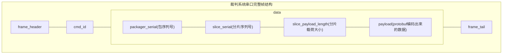

# MasterPilot-CustomData 自定义数据协议

本仓库基于`Protobuf`开发, 用于约定自定义客户端通信协议中的自定义数据.

通信协议中有几处自定义数据:

| 消息名 | 发送方 | 频率 | 大小 |
| --- | --- | --- | --- |
| `CustomByteBlock` | 机器人 | 50Hz | 固定300Byte |
| `CustomControl` | 自定义客户端 | 75Hz | 固定30Byte |

## 数据格式(对应裁判系统通信协议中的`data`块)

`[package_serial]` `[slice_serial]` `[slice_payload_length]` `[payload ...]`

- `package_serial`: **uint8** 数据, 表示此大包的递增序号.
- `slice_serial`: **uint8** 数据, 表示此分片的递增序号.
- `slice_payload_length`: **uint16小端** 数据, 表示本次切片的载荷大小. 如果不满则表示发送完成.
- `payload`: 使用`ProtoBuf`编码出来`uint8[]`数据的一部分

这部分可以使用本仓库中`src`里的代码自动完成.

## 完整通信链路数据帧

补充自通信协议手册 - 表1-2



其中:
- `data`: 不使用通信手册中给的结构体, 使用上文讲的`数据格式`.

## 通信流程

### 发送

1. 填好生成代码中的`XXXDataPacketToClient`结构体
2. 把上一步的结构体传给`protobuf`库的编码器, 得到`package`字节流
3. 将`package`切成分片, 加上帧头, 得到`data`
4. 将`data`打包成裁判系统串口所需的格式, 发送

### 接收

1. 解析裁判系统发来数据, 得到`data`
2. 将`data`按照上文定义的帧头拼接, 得到`package`
3. 将`package`使用`protobuf`解码, 得到`XXXDataPacketFromClient`结构体
4. 读取结构体内容

## 使用教学

### C

#### 代码拉取

- 第一次使用: git clone [仓库url]/release-c
- 后续更新: git pull

#### Keil配置

1. 添加.c源码: 将`src`目录的.c文件添加到`Keil`的编译目标
2. 添加.h路径: 将`include`目录添加到`Keil`的头文件搜索路径
3. 添加编译宏: 将宏`PB_C99_STATIC_ASSERT`添加到`Keil`的编译宏.

#### 发送
TODO

#### 接收
TODO


## 环境配置

**下文为`nix`配置, 如果你不用`nix`或`linux`, 请让AI根据本项目nix代码生成环境配置教程**

### 开发环境准备:

0. 安装nix. [官方教程](https://nixos.org/download/) [清华源](https://mirrors.tuna.tsinghua.edu.cn/help/nix/)
1. 克隆仓库
2. `vscode`打开本仓库, 安装工作区推荐插件
3. 进入`nix`开发环境.
	- 方法A:
		使用`Nix-env`插件提供的环境选择功能, 选择`flake.nix`中的`default`环境.
	- 方法B:
		0. 确保装有`direnv`. [github](https://github.com/direnv/direnv)
		1. 终端打开仓库目录, 根据提示输入
			```bash
			direnv allow
			```
		2. 输入
			```bash
			code .
			```
			打开vscode.
			后续可以通过`direnv`插件直接进入开发环境.
	- 方法C:
		1. 终端输入
			```bash
			nix develop
			```
			进入开发环境
		2. 开发环境下打开vscode
			```bash
			code .
			```

## 注意事项

- 务必使用`git`, `nix`, `cmake`等等动态拉取, 或其他支持更新的上游引用方式引入本项目, **禁止**直接复制文件.

- 请自行定义数据处理的`结构体`/`Model`, 不应该直接使用生成的代码来做其他代码逻辑, 不然架构爆炸.

- 修改协议可提issue or pr, 或者飞书交流
