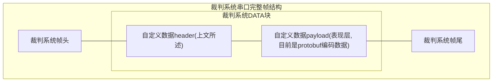
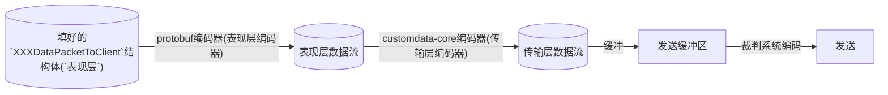
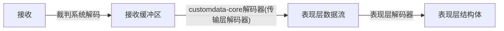

# MasterPilot-CustomData 自定义数据协议

本仓库基于`Protobuf`开发, 用于约定自定义客户端通信协议中的自定义数据.

通信协议中有几处自定义数据:

| 消息名 | 发送方 | 频率 | 大小 |
| --- | --- | --- | --- |
| `CustomByteBlock` | 机器人 | 50Hz | 固定300Byte |
| `CustomControl` | 自定义客户端 | 75Hz | 固定30Byte |

## 数据格式(对应裁判系统通信协议中的`data`块)

`[package_serial]` `[slice_serial]` `[sender_id]` `[eop]` `[slice_payload_length]` `[payload ...]`

**全都是小端序, LSB**

- `package_serial`: **8bit** 数据, 表示此大包的递增序号.
- `slice_serial`: **8bit** 数据, 表示此分片的递增序号.
- `sender_id`: **3bit** 数据, 用于标识发送方, 防止链路冲突.
- `eop`: **1bit** 数据, 1表示当前slice是包最后一片.
- `slice_payload_length`: **12bit** 数据, 表示本次切片的载荷大小. 如果不满则表示发送完成.
- `payload`: 使用`ProtoBuf`编码出来`uint8[]`数据的一部分

这部分可以使用本仓库中`src`里的代码自动完成.

## 完整通信链路数据帧

补充自通信协议手册 - 表1-2



其中:
- `DATA块`: 不使用通信手册中给的结构体, 使用上文讲的`数据格式`.

## 通信流程

### 发送




### 接收



## 使用教学

以无人机为例.

### C

TODO: 已过时

#### 代码拉取

- 第一次使用: git clone [仓库url] -b dist/c-src --depth=1
- 后续更新: git pull

#### Keil配置

1. 添加.c源码: 将`src`目录的.c文件添加到`Keil`的编译目标
2. 添加.h路径: 将`include`目录添加到`Keil`的头文件搜索路径, 注意只需要`include`目录, 不需要添加内部的目录, 保持结构.
3. 添加编译宏: 将宏`PB_C99_STATIC_ASSERT`添加到`Keil`的编译宏.

#### 发送(编码)
```c
#include <masterpilot/customdata-nanopb.h> //这个是编码和收发缓冲区的库
#include <masterpilot/proto/drone.h> //这个是与自定义客户端的表现层协议库. 按你的兵种引用.

// 这是把数据块套上裁判系统帧头帧尾,并串口发送的函数
bool send_to_refree(const uint8_t* block, uint16_t block_length);

// 前面两个参数分别是数据块的指针和长度, 后面的是额外状态参数, 板子上一般只会有一个sender, 不管就行
uint16_t mp_consumer(const uint8_t* source_block, uint16_t block_length, void* user)
{
	send_to_refree(source_block, block_length);
	// 发了多少返回多少, 这里就当作是全发了
	return block_length;
}

// 封装成轮椅人都会用的编码函数
// 这里拿飞机当例子. 传入消息结构体
void mp_drone_encode(mp_sender_t* sender, const MP_DroneDataPacketToClient* msg)
{
	//把包编码进缓冲区, 此时还没发.
	MP_Encode(sender, MP_DroneDataPacketToClient_fields, msg);
}

// 这是一个以50hz频率调用的函数.
void task_call_me_at_50hz(void* args)
{
	//从你的参数里取出sender, 我假设args就是sender
	mp_sender_t* sender = (mp_sender_t*)args;

	//最后一个参数user是你想传给回调函数的额外参数. 只有一个sender的话可以不管它, 或者把这个线程id传进去.
	//跑到这一步, 会调用你的consumer, 把包发出去, 并且自动归还一部分缓冲区
	//返回值是bool, 表示有没有成功, 可以用来写重传. 一般来说串口不会失败.
	MP_Send(sender, mp_consumer, NULL);
}


// 实例逻辑: 飞机发送灯模式和pid模式, 但是不发其他数据.
void main()
{
	static uint8_t sender_buffer[300*16]; //换成具体的分配逻辑. 不能比mtu*buffer_count小
	mp_sender_t sender = {
		.config = {
			.mtu = 300; //板子到自定义客户端, 目前RM要求必须填300
			.buffer_count = 16; //看你分配, 这个是缓存编码小包的数量
			.buffer = sender_buffer;
		};
	};

	// 这个怎么分配看你. 这里仅做实例
	MP_DroneDataPacketToClient msg = {
		.has_lamp = true, //发灯
		.lamp = MP_LC_OUTPOST //这里换成具体的值

		.has_pid = true; //发pid模式
		.pid = MP_PM_MEC; //这里同样换成具体值

		//因为其他字段默认初始化是0, has都是false, 所以最后不会被编码进去, 带宽占用很小.
		//比如那一大串雷达数据, 因为没标has, 所以不会占用带宽.
	};

	//编码, 塞进缓冲区
	mp_drone_encode(&sender, &msg);

	//因为上面有个task, 所以发送是自动的, 编码就行了.
}


```

#### 接收(解码)
TODO

### C++

TODO: 已过时

以英雄为例

#### 代码拉取

- 第一次使用: git clone [仓库url] -b dist/cpp-src --depth=1
- 后续更新: git pull

#### 构建系统配置

- 不用配, 拉取下来就有cmake了, `add_directory`就行.

#### 发送

```cpp
#include <masterpilot/customdata-protobuf-sender.hpp>
#include <masterpilot/proto/hero.pb.h>

// 定时调用的函数, 用来把缓冲区发给电控
void call_me_repeatedly(
	const masterpilot::customdata::Sender& sender
)
{
	//返回值: 是否成功, 可以用来设计重传. 串口应该不会失败.
	sender.flush();
}

int main()
{
	masterpilot::customdata::Sender sender
	{
		300, //mtu
		16, //buffer数量 会自动分配(底层是vector)
		[&send_to_my_serial](auto block) -> int //具体的发送实现
		{
			//加装帧头, 让串口把span发出去. 假设全发完了没阻塞
			//注: 电控直接转发这一块即可, 不需要在电控那里再解析.
			send_to_my_serial(block);

			//发成功多少返回多少.
			return block.size();
		}
	};

	// 这里换成实际编码相机出来的帧.
	std::string nz2 = "哪吒之魔童闹海";

	HeroDataPacketToClient msg;
	// 这一步set完后, 会自动带上has, 不用额外处理
	msg.set_camera_frame(nz2);

	//传进缓冲区
	sender.Feed(msg);
}

```

#### 接收

TODO


### C#

参考自定义客户端项目`MasterPilot`.


## 环境配置

**下文为`nix`配置, 如果你不用`nix`或`linux`, 请让AI根据本项目nix代码生成环境配置教程**

### 开发环境准备:

0. 安装nix. [官方教程](https://nixos.org/download/) [清华源](https://mirrors.tuna.tsinghua.edu.cn/help/nix/)
1. 克隆仓库
2. `vscode`打开本仓库, 安装工作区推荐插件
3. 进入`nix`开发环境.
	- 方法A:
		使用`Nix-env`插件提供的环境选择功能, 选择`flake.nix`中的`default`环境.
	- 方法B:
		0. 确保装有`direnv`. [github](https://github.com/direnv/direnv)
		1. 终端打开仓库目录, 根据提示输入
			```bash
			direnv allow
			```
		2. 输入
			```bash
			code .
			```
			打开vscode.
			后续可以通过`direnv`插件直接进入开发环境.
	- 方法C:
		1. 终端输入
			```bash
			nix develop
			```
			进入开发环境
		2. 开发环境下打开vscode
			```bash
			code .
			```

## 注意事项

- 务必使用`git`, `nix`, `cmake`等等动态拉取, 或其他支持更新的上游引用方式引入本项目, **禁止**直接复制文件.

- 请自行定义数据处理的`结构体`/`Model`, 不应该直接使用生成的代码来做其他代码逻辑, 不然架构爆炸.

- 修改协议可提issue or pr, 或者飞书交流
